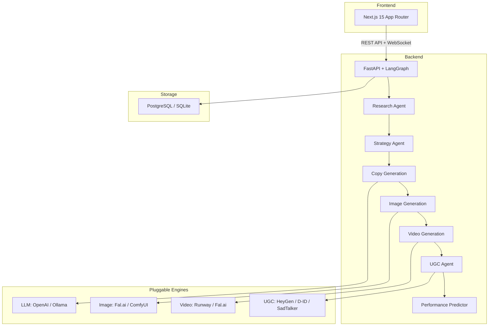

<p align="center">
  <picture>
    <source media="(prefers-color-scheme: dark)" srcset="docs/src/assets/logo-dark.svg" />
    <source media="(prefers-color-scheme: light)" srcset="docs/src/assets/logo.svg" />
    
  </picture>
</p>

<p align="center">
  <strong>Open-Source AI Marketing Agent Platform</strong>
</p>

<p align="center">
  <a href="https://github.com/opensns-dev/opensns/actions"></a>
  <a href="https://github.com/opensns-dev/opensns/blob/main/LICENSE"></a>
  <a href="https://opensns-dev.github.io/opensns/"></a>
</p>

<p align="center">
  Self-hostable AI marketing agent that generates ad creatives from a product URL.<br>
  100% open-source. Own your data. No vendor lock-in.
</p>

---

<p align="center">
  <a href="#features">Features</a> •
  <a href="#demo">Demo</a> •
  <a href="#quick-start">Quick Start</a> •
  <a href="#architecture">Architecture</a> •
  <a href="#pricing">Pricing</a> •
  <a href="#roadmap">Roadmap</a> •
  <a href="#community">Community</a>
</p>

## Demo


<!-- Record: URL input → campaign generation → multi-platform output in under 60 seconds -->

Paste a product URL. Get complete ad campaigns in under 60 seconds.

## Why OpenSNS?

**The open-source alternative to Zet AI and AdCreative.ai.**

| | OpenSNS | Zet AI | AdCreative.ai |
|---|---|---|---|
| **Self-hosted** | ✅ Unlimited | ❌ Cloud only | ❌ Cloud only |
| **Data ownership** | ✅ You own everything | ❌ Vendor lock-in | ❌ Vendor lock-in |
| **Naver platforms** | ✅ 15+ platforms | ❌ Limited | ❌ None |
| **Pluggable engines** | ✅ Swap LLM/Image/Video | ❌ Fixed | ❌ Fixed |
| **Price** | Free / $9+ | $49+/mo | $29+/mo |

**Self-hosted = unlimited generations for free.** Run on your own hardware with your own API keys. No per-credit markups. No usage limits.

**15+ Naver platform support.** The only open-source tool with deep integration for Korea's dominant ad ecosystem.

**Pluggable engine architecture.** Use OpenAI today, switch to Ollama tomorrow. Swap Fal.ai for ComfyUI. Your choice, your control.

## Features

### Core AI Pipeline
- **Product Analysis** — Scrapes and analyzes product pages to extract features, benefits, and positioning
- **Competitor Research** — AI-powered competitive analysis and differentiation strategy
- **Multi-Angle Strategy** — Generates multiple marketing angles for testing different approaches
- **Ad Copy Generation** — Platform-specific copy optimized for each channel's audience
- **Image Generation** — AI-generated product images via Fal.ai, FluxPro, or ComfyUI
- **Video Generation** — Image-to-video conversion for TikTok, Reels, and Stories
- **UGC Video** — AI avatar videos with HeyGen, D-ID, or self-hosted SadTalker
- **Performance Prediction** — AI-powered CTR and engagement forecasting
- **Multi-Platform Optimization** — Automatic resizing and formatting for each platform's specs

### P0: Essential Tools
- **Template Library** — 40+ proven ad templates for quick campaign starts
- **Brand Kit** — Store logos, colors, fonts, and brand guidelines for consistent output
- **Direct Publishing** — One-click publish to META platforms (Instagram, Facebook)

### P1: Growth & Collaboration
- **A/B Testing** — Built-in split testing with statistical significance tracking
- **Team Collaboration** — Role-based access control (RBAC) for agencies and teams
- **Ad Performance Analytics** — Track real performance vs. AI predictions
- **i18n** — Full Korean (한국어) and English support

### P2: Power User Features
- **Public API** — REST API for integrating with external tools and workflows
- **Prediction vs Actual Tracking** — Compare AI forecasts with real campaign data
- **Scheduling Calendar** — Plan and queue campaigns for optimal timing

### P3: Enterprise & White-Label
- **Custom Voice/Avatar** — Train custom AI voices and avatars for UGC
- **White-Label** — Rebrand OpenSNS for your agency clients
- **Ad Serving** — Serve ads directly from OpenSNS (future)

### NEW: Latest Additions
- **Product Photography AI** — Generate professional product shots from simple inputs
- **AI Content Labeling** — Automatic labeling for AI-generated content compliance
- **BYOK Plan** — Bring Your Own API Keys on the hosted cloud platform

## Quick Start

### One-Click Deploy

[](https://railway.app/new/template?template=https://github.com/opensns-dev/opensns)
[](https://render.com/deploy?repo=https://github.com/opensns-dev/opensns)

### Docker Compose (Recommended)

```bash
git clone https://github.com/opensns-dev/opensns.git
cd opensns

# Copy and configure environment
cp .env.example .env

# Generate required secrets
# JWT_SECRET_KEY and API_KEY_ENCRYPTION_KEY are required
# Generate with: openssl rand -hex 32

# Start all services
docker compose up -d

# Access the app
# Frontend: http://localhost:3000
# Backend API: http://localhost:8000
# API Docs: http://localhost:8000/docs
```

### Manual Setup

<details>
<summary><strong>Backend</strong></summary>

```bash
cd backend
python -m venv venv
source venv/bin/activate  # Windows: venv\Scripts\activate
pip install -r requirements.txt

cp .env.example .env
# Edit .env with your settings

uvicorn app.main:app --reload
```

</details>

<details>
<summary><strong>Frontend</strong></summary>

```bash
cd frontend
bun install
cp .env.example .env.local

bun dev
```

</details>

## Architecture



## Supported Platforms

### Global Platforms

| Platform | Feed | Story | Video | Shopping |
|----------|------|-------|-------|----------|
| **Instagram** | ✅ | ✅ | ✅ Reels | ✅ |
| **Facebook** | ✅ | ✅ Stories | ✅ | ✅ |
| **Google Ads** | ✅ Display | — | — | — |
| **TikTok** | ✅ | — | ✅ | — |
| **YouTube** | — | ✅ Shorts | ✅ | — |
| **X/Twitter** | ✅ | — | — | — |
| **LinkedIn** | ✅ | — | — | — |

### Korea (Naver) Platforms

| Platform | Search | Feed | Video | Shopping |
|----------|--------|------|-------|----------|
| **Naver PowerLink** | ✅ | — | — | — |
| **Naver Brand Search** | ✅ | — | — | — |
| **Naver GFA** | — | ✅ Native | — | — |
| **Naver GFA Banners** | — | ✅ | — | — |
| **Naver Shopping** | — | — | — | ✅ Product |
| **Naver Brand Zone** | — | — | — | ✅ |
| **Naver TV** | — | — | ✅ | — |
| **Naver Shorts** | — | — | ✅ | — |
| **Naver Blog** | — | ✅ Content | — | — |
| **Naver Cafe** | — | ✅ Content | — | — |
| **Kakao Display** | — | ✅ | — | — |
| **Kakao Bizboard** | — | ✅ | — | — |

## Built With

- **[FastAPI](https://fastapi.tiangolo.com/)** — Modern, fast web framework for building APIs
- **[LangGraph](https://langchain-ai.github.io/langgraph/)** — Orchestration framework for agent workflows
- **[Next.js 15](https://nextjs.org/)** — React framework with App Router
- **[shadcn/ui](https://ui.shadcn.com/)** — Re-usable components built with Radix UI and Tailwind
- **[SQLModel](https://sqlmodel.tiangolo.com/)** — SQL databases in Python, designed for simplicity
- **[Fal.ai](https://fal.ai/)** — Fast image and video generation inference
- **[ComfyUI](https://github.com/comfyanonymous/ComfyUI)** — Powerful and modular diffusion model GUI

## Pricing

| Plan | Price | Credits | Best For |
|------|-------|---------|----------|
| **Free** | $0 | 50/mo | Trying it out |
| **Basic** | $9/mo | 150/mo | Indie marketers |
| **BYOK** | $15/mo | Unlimited | Bring Your Own API Keys |
| **Pro** | $29/mo | 500/mo | Growing teams (up to 3) |
| **Ultra** | $59/mo | 1,200/mo | Agencies (up to 10 seats) |

**Self-hosted = unlimited for free.** When you self-host, you bring your own API keys. You only pay for the actual AI generation costs (OpenAI, Fal.ai, etc.) with no markup. Generate thousands of creatives for the cost of the raw API calls.

**BYOK (Cloud)** — Use your own API keys on our hosted platform. Unlimited generations for a flat $15/mo infrastructure fee.

Credit costs:
- 1 image generation = 1 credit
- 1 video generation = 12 credits

## Roadmap

### Completed ✅
- [x] Product analysis from URL
- [x] Competitor research
- [x] Multi-angle strategy generation
- [x] Ad copy for 15+ platforms
- [x] Image generation (Fal.ai, ComfyUI)
- [x] Video generation (Runway, Fal.ai)
- [x] UGC video (HeyGen, D-ID, SadTalker)
- [x] Performance prediction
- [x] Multi-platform optimization
- [x] Template library (40 templates)
- [x] Brand Kit
- [x] Direct META publishing
- [x] i18n (Korean + English)

### In Progress 🚧
- [ ] A/B testing framework
- [ ] Team collaboration (RBAC)
- [ ] Ad performance analytics
- [ ] Public API
- [ ] Product Photography AI

### Planned 📋
- [ ] Prediction vs actual tracking
- [ ] Scheduling calendar
- [ ] Custom voice/avatar training
- [ ] White-label option
- [ ] AI content labeling

## Documentation

Full documentation is available at **[opensns-dev.github.io/opensns](https://opensns-dev.github.io/opensns/)**

- [Introduction](https://opensns-dev.github.io/opensns/getting-started/introduction/)
- [Quick Start Guide](https://opensns-dev.github.io/opensns/getting-started/quickstart/)
- [Configuration](https://opensns-dev.github.io/opensns/getting-started/configuration/)
- [Architecture Overview](https://opensns-dev.github.io/opensns/architecture/overview/)
- [API Reference](https://opensns-dev.github.io/opensns/api/)

## Community

- **[Discord](https://discord.gg/opensns)** — Chat with the community and get help
- **[GitHub Discussions](https://github.com/opensns-dev/opensns/discussions)** — Ask questions and share ideas
- **[Twitter/X](https://twitter.com/opensns_dev)** — Follow for updates and tips

## Development

```bash
# Backend tests
cd backend && pytest -v

# Frontend tests
cd frontend && bun test

# E2E tests
cd frontend && bun e2e

# Linting
cd backend && ruff check app/
cd frontend && bun lint
```

## Star History

[](https://star-history.com/#opensns-dev/opensns&Date)

## License

MIT License — see [LICENSE](LICENSE) for details.

## Contributing

Contributions are welcome! Please read [CONTRIBUTING.md](CONTRIBUTING.md) for guidelines.

---

<p align="center">
  Made with ❤️ by the OpenSNS community
</p>
