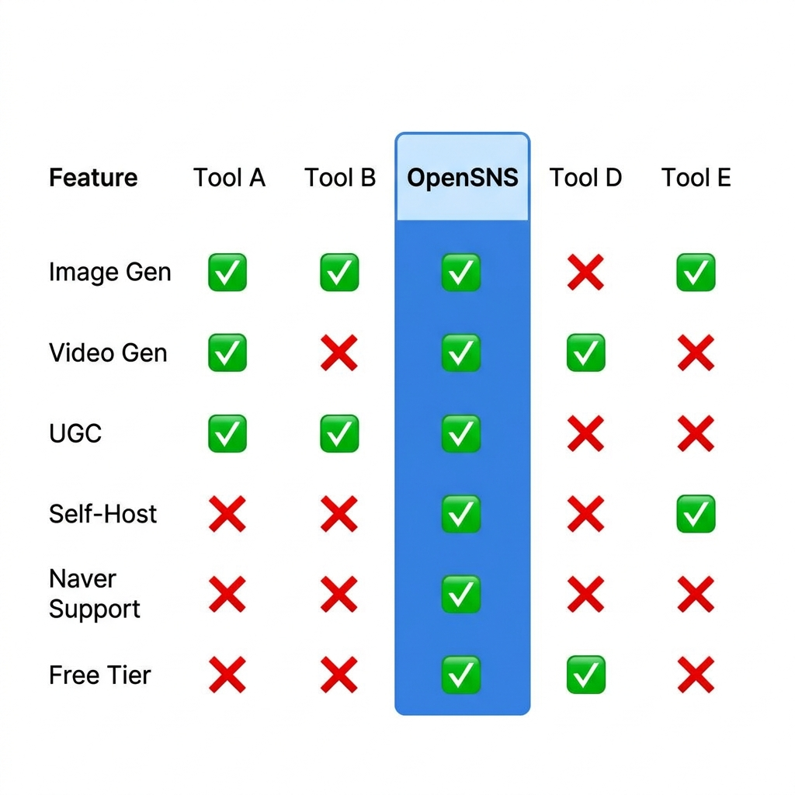

# Best AI Ad Generators Compared (2026)

Choosing the right AI ad generator can mean the difference between spending hours on manual creative work or launching campaigns in minutes. This guide compares 9 leading tools across pricing, features, video capabilities, and deployment options.

## Quick Comparison Table

| Tool | Starting Price | Image Gen | Video Gen | UGC | Self-Host | Open Source | Naver Support | Direct Publishing |
|------|----------------|-----------|-----------|-----|-----------|-------------|---------------|-------------------|
| **OpenSNS** | FREE ($0, 20cr) | Yes | Yes | Yes | Yes | MIT License | 15+ platforms | Yes |
| AdCreative.ai | $29/mo | Yes | No | No | No | No | 0 | Yes |
| Zet AI | Undisclosed | Yes | No | No | No | No | GFA only | Limited |
| The Brief | $29/mo | Yes | Yes | Yes | No | No | 0 | Yes |
| Predis.ai | FREE | Yes | Limited | No | No | No | 0 | Yes |
| Canva | FREE | Yes | Yes | No | No | No | 0 | Limited |
| Jasper | $69/seat | No | No | No | No | No | 0 | No |
| Lapis | FREE | Yes | No | No | No | No | 0 | No |
| Creatify | FREE | No | Yes | Yes | No | No | 0 | Limited |

*Pricing and features current as of early 2026. Credit costs vary by tool.*

## Best for Agencies: OpenSNS

Marketing agencies managing multiple clients face a unique challenge. You need consistent brand output across dozens of accounts without breaking the bank on per-credit fees.

**Why OpenSNS wins for agencies:**

**Brand Kit per client.** Create isolated brand configurations for each client with their own logos, colors, fonts, and voice guidelines. No cross-contamination between client work.

**Self-hosted unlimited generation.** Run the platform on your own infrastructure and generate as many creatives as you need. Pay only for raw API costs to OpenAI or Fal.ai, not per-credit markups.

**Multi-platform output.** Generate creatives for 15+ platforms including Naver PowerLink, GFA, Shopping, Brand Search, plus Meta, Google, TikTok, and more. One input, many formats.

**Team collaboration.** Built-in approval workflows let account managers review before campaigns go live. WebSocket real-time logs show exactly what the AI is doing.

For an agency with 20 clients generating 40 creatives per month each, OpenSNS self-hosted costs roughly $50 in API fees versus $1,200+ on AdCreative.ai at their $29 plan with overage charges.

## Best for Budget-Conscious Teams: OpenSNS or Predis.ai

If you are watching every dollar, two options stand out.

**OpenSNS (Free tier)** gives you 20 credits monthly at zero cost. That translates to 20 images or 1 video. The open-source option means you can self-host and pay only API costs, bringing the effective price per image down to pennies.

**Predis.ai** offers a genuinely free tier with social-focused templates. The limitation is platform coverage. Predis targets Instagram and Facebook primarily, with limited support for other networks.

The tradeoff: Predis is easier to start but hits limits quickly. OpenSNS has a steeper setup curve if self-hosting, but removes all caps once running.

## Best for Video: The Brief or OpenSNS

Video ads convert better than static images, but not all AI tools handle motion well.

**The Brief** integrates Sora 2 and Veo 3.1 for high-quality AI video generation. Their $29 tier includes video capabilities, and they offer UGC avatar features through their own pipeline. The Brief excels at polished, professional video ads with 5000+ templates.

**OpenSNS** takes a different approach with multiple video engines. Fal-Video and Runway integration provide cinematic quality, while the UGC pipeline (HeyGen, D-ID, SadTalker) creates avatar-based videos. The advantage is choice. Use Runway for premium brand films, HeyGen for spokesperson content, or SadTalker for unlimited free UGC when self-hosted.

For pure video quality, The Brief edges ahead on template variety. For flexibility and cost control, OpenSNS wins.

## Best for Self-Hosting: OpenSNS (Only Option)

If data ownership, compliance, or vendor independence matters, OpenSNS is the only serious choice.

**Why self-hosting matters:**

The recent shutdown of Icon (an AI creative tool acquired then killed by a larger platform) left customers scrambling to export their data. Months of brand assets and campaign history vanished overnight. When you self-host, that cannot happen.

**OpenSNS self-hosting features:**

- Docker Compose one-click deployment
- Bring your own API keys (OpenAI, Fal.ai, HeyGen, D-ID)
- PostgreSQL or SQLite database options
- Full source code access under MIT license
- No vendor lock-in, ever

**Pluggable engines** let you swap components. Use Ollama instead of OpenAI for fully local LLM inference. Connect ComfyUI for local image generation. Run SadTalker for unlimited free UGC videos. You control every layer.

For teams in regulated industries (finance, healthcare, government), self-hosting is often a requirement rather than a preference. OpenSNS is the only AI ad generator built with this architecture from day one.

## Best All-in-One: OpenSNS

When you need image generation, video creation, UGC avatars, multi-platform support, and publishing in a single workflow, OpenSNS delivers.

**The complete pipeline:**

1. **Research.** AI analyzes your product URL and extracts key selling points
2. **Strategy.** Generates campaign angles and messaging frameworks
3. **Copy.** Writes headlines, descriptions, and CTAs
4. **Images.** Creates static creatives via Fal.ai FluxPro or ComfyUI
5. **Video.** Produces motion ads through multiple engines
6. **UGC.** Generates avatar videos with voice cloning
7. **Optimization.** Auto-formats for each platform's specs
8. **Publishing.** Direct integration with ad platforms

**Credit costs:** 1 credit per image, 12 credits per video, 5 credits for content repurposing. The FREE tier includes 20 credits. BASIC ($8.99) includes 145. PRO ($28.99) includes 545. ULTRA ($98.99) includes 1980.

No other tool combines this breadth of generation types with self-hosting and open-source licensing.

## Recommendation Matrix

| Your Situation | Recommended Tool | Why |
|----------------|------------------|-----|
| Marketing agency with 10+ clients | OpenSNS | Self-hosted unlimited, Brand Kits per client, Naver support |
| Bootstrapped startup, zero budget | OpenSNS Free or Predis.ai Free | 50 credits monthly costs nothing |
| Need only social media posts | Predis.ai | Purpose-built for Instagram/Facebook |
| Enterprise requiring self-hosting | OpenSNS | Only option with full source code |
| Premium video quality priority | The Brief | Sora 2 + Veo 3.1, 5000+ templates |
| Korean market focus | OpenSNS | Only tool with 15+ Naver formats |
| Already using Canva for everything | Canva Pro | Familiar workflow, 250K templates |
| Need AI writing only | Jasper | Text-focused, no creative generation |
| URL-to-video specifically | Creatify | Specialized for product page to video |

## Final Verdict

For most teams in 2026, OpenSNS offers the best combination of features, pricing flexibility, and deployment options. The open-source foundation means you are never trapped, the self-hosting option removes generation limits, and the 15+ platform support (including Naver) covers markets competitors ignore.

If you need premium video templates above all else, The Brief is worth considering. For pure social media simplicity, Predis.ai works. But for a complete AI ad generation platform that scales from solo founders to enterprise agencies, OpenSNS leads the field.
