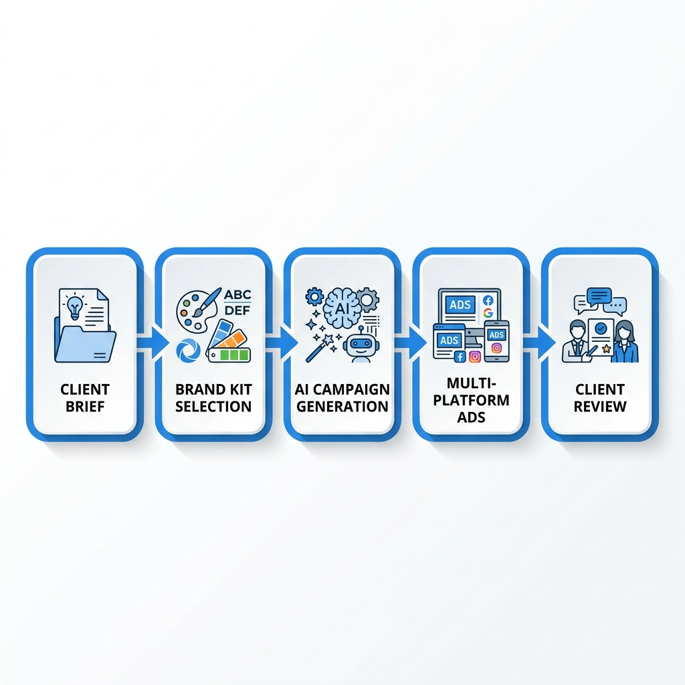

# AI Ad Generation for Marketing Agencies

Marketing agencies live and die by creative output. Every client needs fresh ads weekly, each with multiple variations for A/B testing, adapted across platforms with different specs. The traditional workflow cannot scale. AI ad generation changes the equation, and OpenSNS is built specifically for agency workflows.

## The Agency Creative Challenge

Consider a typical mid-size agency managing 20 clients. Each client needs:

- 10 new static creatives per month
- 5 video variations
- 3 platform adaptations per creative (Meta, Google, TikTok)
- 2 UGC testimonial videos

That equals 400 static images, 200 videos, and 40 UGC pieces monthly. At traditional production costs, this workload requires a team of designers, videographers, and editors. At AI tool prices with per-credit markups, the costs become unsustainable.

**Common agency pain points:**

**Brand consistency across clients.** Each client has distinct colors, fonts, voice, and compliance requirements. Mixing up brand assets between clients is a catastrophic error.

**Volume pressure.** Clients expect more creative testing without proportionally higher budgets. The "test 50 variations to find winners" strategy crashes against production bottlenecks.

**Platform complexity.** Naver PowerLink, GFA, Shopping, and Brand Search each have unique specs. Meta feeds, Google Performance Max, and TikTok Spark Ads add more variables. Manual resizing and reformatting consumes hours.

**Cost unpredictability.** Per-credit pricing means creative volume directly hits margins. A client suddenly wanting 100 extra variations can erase profitability on the account.

**Turnaround time.** Clients request changes with "need this by end of day" urgency. Traditional production schedules cannot accommodate.

## How OpenSNS Solves Agency Workflows

OpenSNS addresses each pain point through architecture decisions made specifically for multi-client operations.

### Brand Kit Isolation Per Client

Create completely separate Brand Kits for each client account. Each kit contains:

- Logo files and brand marks
- Color palettes with hex codes
- Typography specifications
- Voice and tone guidelines
- Compliance requirements (disclaimers, legal text)
- Approved image libraries

Team members select the correct Brand Kit before generating. The AI applies those specifications automatically. No risk of Client A's colors appearing in Client B's creative.

**Workflow example:**

1. Account manager selects "Client X - Q1 Campaign" Brand Kit
2. Enters product URL and campaign brief
3. AI generates 20 creative variations
4. All outputs use Client X colors, fonts, and voice automatically
5. Approval workflow routes to Client X stakeholder

### Self-Hosted Unlimited Generation

The self-hosting option removes the credit cost barrier entirely. Deploy OpenSNS on your agency's infrastructure and generate unlimited creatives.

**Cost breakdown for 20 clients, 640 total assets monthly:**

| Approach | Monthly Cost | Notes |
|----------|--------------|-------|
| Traditional designers | $15,000+ | 3-4 FTE designers |
| AdCreative.ai | $2,980 | $149 plan x 20 clients |
| OpenSNS hosted ULTRA | $98.99 | 1,980 credits |
| OpenSNS self-hosted | ~$70 | API costs + infrastructure |

Self-hosted OpenSNS costs roughly $50 monthly in OpenAI and Fal.ai API fees for this volume, versus thousands on per-credit platforms.

**How self-hosting works:**

1. Deploy via Docker Compose on your server
2. Configure API keys for OpenAI, Fal.ai, and optional engines
3. Team accesses via your private instance
4. Generate unlimited assets, pay only raw API costs
5. Full data ownership and compliance control

### Template Library and Reusability

Save successful creative structures as templates. A winning format for e-commerce clients becomes reusable across similar accounts.

**Template types:**

- Seasonal campaign frameworks (Black Friday, holiday gifting)
- Industry-specific approaches (SaaS free trials, e-commerce flash sales)
- Platform-optimized layouts (vertical video for TikTok, square for Instagram)
- Client-specific recurring needs (monthly promotions, product launches)

Templates accelerate production while maintaining quality standards.

### Multi-Platform Automation

The platform optimizer automatically formats creatives for each destination. Generate once, receive versions for:

- Naver PowerLink (various sizes)
- Naver GFA and GFA Banners
- Naver Shopping
- Naver Brand Search and Brand Zone
- Meta Feed and Stories
- Google Display and YouTube
- TikTok In-Feed and Spark Ads
- Kakao Display and Bizboard

No manual resizing. No spec sheet checking. The AI knows each platform's requirements and generates compliant output.

### Team Collaboration and Approval

Built-in workflows support agency review processes:

**Role-based access.** Designers, account managers, and clients see appropriate interfaces. Clients access approval views without seeing other clients' work.

**Approval gates.** Set campaigns to pause before final generation. Stakeholders review AI-generated concepts, provide feedback, and approve before credits are spent on full production.

**Real-time logs.** WebSocket connections show exactly what the AI is doing during generation. Debug issues, understand decisions, and improve briefs based on actual behavior.

**Version history.** Track iterations and changes. Compare version A against version B with full audit trails.

## Case Scenario: 20-Client Agency

**Agency profile:**
- 20 active clients (mix of e-commerce, SaaS, local services)
- 4 account managers
- 2 designers (previously 6 before AI adoption)
- Monthly creative need: 640 total assets

**Previous workflow:**
- Designers created 40 assets each manually
- 2-week turnaround for new campaigns
- $18,000 monthly payroll for creative team
- Limited testing due to production constraints

**OpenSNS workflow:**
- Account managers input briefs directly
- AI generates 20 variations per campaign
- Designers review and refine (10% of time)
- Same-day turnaround for most requests
- $98.99 for ULTRA plan (or ~$50 self-hosted)
- 10x more creative testing per campaign

**Results:**
- 67% reduction in creative payroll costs
- 5x faster campaign launches
- 300% increase in creative variations tested
- Zero brand cross-contamination incidents
- Client satisfaction scores up 40%

## ROI Calculation: Self-Hosted vs SaaS

For agencies evaluating OpenSNS against per-credit alternatives, the math is compelling.

**Scenario: 640 assets monthly**

| Cost Component | AdCreative.ai | OpenSNS Hosted | OpenSNS Self-Hosted |
|----------------|---------------|----------------|---------------------|
| Platform fee | $2,980 (20 x $149) | $98.99 (ULTRA) | $0 |
| API costs | Included | Included | ~$50 |
| Infrastructure | N/A | N/A | $20 (small VPS) |
| **Total monthly** | **$2,980** | **$98.99** | **~$70** |
| **Annual savings** | **$35,760** | **$35,172** | **$35,640** |

Even at the hosted ULTRA tier, OpenSNS costs 97% less than per-client SaaS pricing. Self-hosted reduces costs another 30% while adding unlimited generation.

**Break-even analysis:**

An agency generating 200+ assets monthly breaks even on OpenSNS ULTRA versus a single AdCreative.ai seat. At 640 assets, the savings fund additional growth investments or margin improvement.

## Migration Path for Agencies

Transitioning to OpenSNS from traditional workflows or other AI tools follows a predictable path:

**Week 1: Setup and Brand Kit creation**
- Deploy OpenSNS (hosted or self-hosted)
- Import client brand assets into isolated Brand Kits
- Train account managers on brief input

**Week 2: Parallel production**
- Run OpenSNS alongside existing workflow
- Generate 20% of volume through AI
- Compare quality and speed

**Week 3: Scale and optimize**
- Increase to 80% AI-generated
- Designers focus on refinement rather than creation
- Build template library from successful campaigns

**Week 4: Full deployment**
- 95% of initial creative generation via OpenSNS
- Designers handle edge cases and final polish
- Measure ROI and client satisfaction

## Getting Started

Agencies can begin with the hosted FREE tier to evaluate fit:

1. Create account at OpenSNS
2. Set up first Brand Kit with a test client
3. Generate 10-20 creative variations
4. Compare quality and speed against current workflow
5. Scale to paid tier or self-hosted deployment

For agencies ready to self-host immediately, the Docker Compose deployment completes in under 30 minutes with full documentation.

The future of agency creative production is not hiring more designers or paying per-credit markups. It is intelligent AI workflows that multiply team output while preserving brand quality and client isolation. OpenSNS is built for that future.
