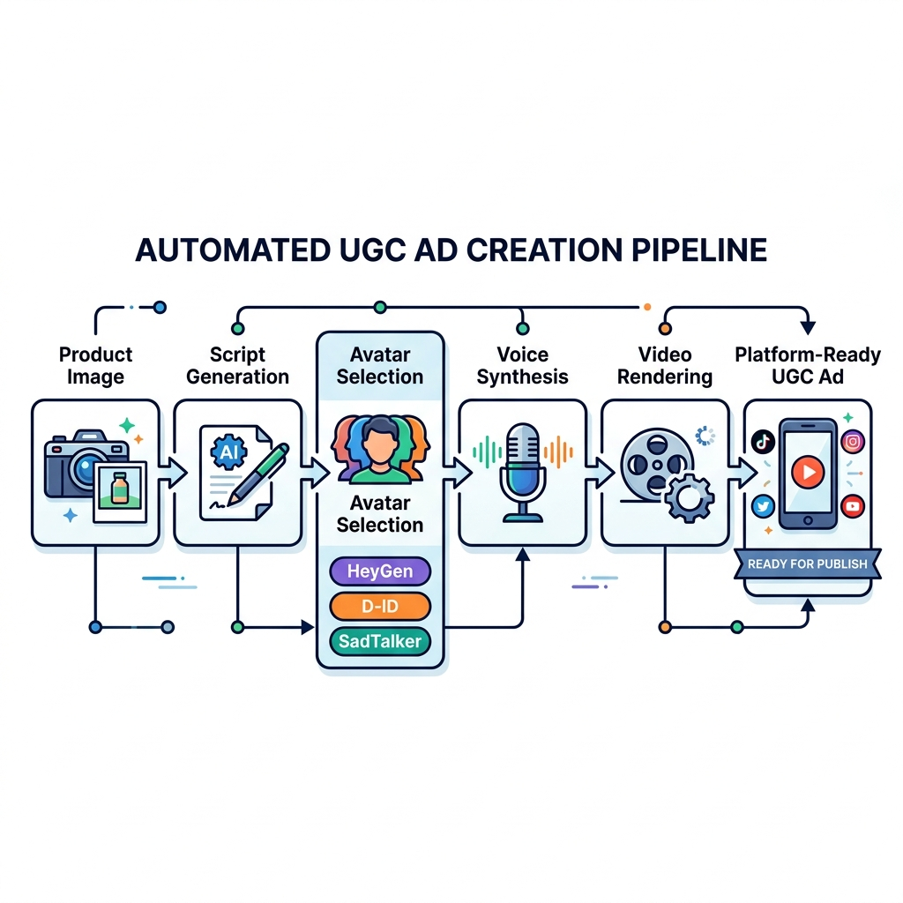

# AI UGC Video Ads: Complete Guide

User-generated content (UGC) videos consistently outperform polished brand content. Real people sharing authentic experiences convert better than corporate messaging. The challenge has always been scale. You cannot film hundreds of real customers. AI UGC solves this by creating virtual spokespeople that look and feel authentic.

## What Is AI UGC Video?

AI UGC video uses artificial intelligence to generate spokesperson content. An AI avatar delivers your script with natural gestures, appropriate facial expressions, and lip-sync that matches the audio. The result resembles a real person recording a testimonial or review on their phone.

**Key characteristics:**

- **Virtual spokesperson.** AI-generated character, not a filmed actor
- **Natural delivery.** Gestures, expressions, and lip-sync that feel human
- **Script control.** You write the message, the AI performs it
- **Scalable production.** Generate 100 variations as easily as one
- **Cost efficiency.** No studio, no actors, no filming days

**When AI UGC works best:**

- Product testimonials and reviews
- App walkthroughs and tutorials
- Feature announcements and updates
- Social proof for landing pages
- Ad creatives for performance marketing
- Explainer content for complex products

**When to use real filming instead:**

- High-stakes brand campaigns requiring celebrity talent
- Content where authenticity verification matters (medical, financial)
- Scenarios where "real customer" claims must be legally defensible
- Ultra-premium positioning where AI generation might undermine perception

For most direct-response and performance marketing, AI UGC delivers comparable results at a fraction of the cost and time.

## The OpenSNS UGC Pipeline

OpenSNS integrates three distinct UGC engines, letting you choose the right tool for each project rather than forcing a one-size-fits-all approach.

**HeyGen integration.**

Premium avatar quality with professional production values. HeyGen avatars display natural hand gestures, diverse wardrobe options, and smooth lip-sync that rivals studio filming.

- 100+ diverse avatars across ages, ethnicities, and styles
- Custom avatar creation from 2-minute video footage
- Voice cloning in 29+ languages
- Talking photo feature for animating headshots
- Premium pricing reflects quality

**Best for:** High-stakes campaigns, customer-facing content, and scenarios where avatar quality directly impacts conversion rates.

**D-ID integration.**

Focuses on subtle realism over animated expressiveness. D-ID avatars show natural micro-movements, breathing patterns, and eye contact that feel genuinely human rather than performative.

- 100+ photorealistic avatars
- Advanced face animation from still photos
- Voice cloning with 119 language support
- Conversational AI integration
- Enterprise security features

**Best for:** Testimonial-style content, educational videos, and scenarios where viewers need to trust the speaker. The realism reduces skepticism.

**SadTalker integration.**

Open-source, self-hostable option for unlimited free generation. Lower visual quality than commercial alternatives, but completely free when self-hosted.

- Generate from any headshot image
- Basic lip-sync and head movement
- Unlimited generation at compute cost only
- Full source code transparency

**Best for:** Testing, internal content, rough drafts, and budget-conscious campaigns where volume matters more than polish.

## How to Choose Your UGC Engine

Selecting the right engine requires balancing quality, cost, and use case requirements.

**Quality comparison:**

| Aspect | HeyGen | D-ID | SadTalker |
|--------|--------|------|-----------|
| Lip-sync accuracy | Excellent | Excellent | Good |
| Gesture naturalness | Excellent | Good | Basic |
| Facial expressions | Animated | Subtle/realistic | Limited |
| Avatar variety | 100+ | 100+ | Unlimited (bring your own) |
| Voice cloning | Yes | Yes | No |
| Production value | Premium | Professional | Basic |

**Cost comparison (per minute of video):**

| Engine | Cost | Best For |
|--------|------|----------|
| HeyGen | ~$1-2 | Premium campaigns |
| D-ID | ~$1-2 | Realistic testimonials |
| SadTalker (self-hosted) | ~$0.01 (compute) | Testing, volume |

**Decision framework:**

Choose **HeyGen** when:
- Campaign budget supports premium production
- Avatar diversity matters (multiple demographics)
- You need custom avatars (create your own spokesperson)
- Quality is the top priority

Choose **D-ID** when:
- Authenticity and trust are key
- You want subtle realism over animated performance
- Enterprise security requirements exist
- The avatar should feel like a real person, not a presenter

Choose **SadTalker** when:
- Budget is constrained
- You need high volume (100+ videos)
- Content is internal or testing-focused
- You are self-hosting OpenSNS

## The Complete UGC Workflow

OpenSNS connects UGC generation to the full ad creation pipeline. You are not just generating videos in isolation. You are creating strategic, on-brand content.

**Step 1: Product analysis**

Enter your product URL. The AI analyzes:
- Key features and benefits
- Target audience and use cases
- Competitive positioning
- Visual assets and branding

**Step 2: Strategy development**

The strategy node determines the UGC approach:
- Testimonial angle ("I tried this product and...")
- Tutorial angle ("Here is how I use...")
- Review angle ("Three things I love about...")
- Story angle ("I was struggling with... then discovered...")

**Step 3: Script generation**

AI writes the spoken script based on:
- Selected strategy angle
- Brand voice guidelines
- Platform requirements (TikTok vs YouTube vs landing page)
- Optimal length for the use case

**Step 4: UGC video generation**

Select your engine and configure:
- Avatar choice (or upload custom for SadTalker)
- Voice (cloned, preset, or uploaded audio)
- Background (transparent, solid color, or uploaded image)
- Aspect ratio (9:16 for TikTok, 16:9 for YouTube, etc.)

Generate the video. Processing time varies by engine (30 seconds to 5 minutes).

**Step 5: Platform optimization**

The platform optimizer formats for destination:
- Adds captions for silent viewing
- Inserts platform-specific elements (TikTok safe zones, YouTube end screens)
- Adjusts resolution and encoding
- Creates thumbnail options

**Step 6: Performance prediction**

Before publishing, the AI estimates:
- Expected CTR based on creative elements
- Comparison to historical performance
- Suggested improvements

**Step 7: Publishing or export**

Download the video file or publish directly to:
- Meta Ads Manager
- Google Ads
- TikTok Ads
- Naver (all formats)
- YouTube

## Best Practices for UGC Ad Performance

AI UGC follows the same performance principles as real UGC. These practices maximize conversion:

**Hook in the first 3 seconds.**

Start with the most compelling benefit or curiosity gap. "I was skeptical until..." or "This changed how I..." Pattern interrupts stop the scroll.

**Keep it under 60 seconds.**

Most effective UGC ads run 15-45 seconds. Longer content works for tutorials, but testimonials should be punchy.

**Show the product in use.**

Do not just talk about the product. Show it solving a problem. Screen recordings, product shots, and demonstration clips intercut with the avatar boost credibility.

**Use captions.**

85% of social video plays without sound. Captions ensure your message lands regardless of audio settings.

**Match platform style.**

TikTok UGC should feel native to TikTok (vertical, fast-paced, trend-aware). YouTube UGC can be more polished. Instagram splits the difference. Generate platform-specific versions.

**Test avatar diversity.**

Different demographics respond to different spokespeople. Generate versions with varied avatars and measure performance. AI UGC makes this testing affordable.

**A/B test scripts.**

The same avatar with different scripts often shows significant performance variance. Test emotional appeals versus logical benefits. Test short versus detailed. Test problem-focused versus solution-focused.

**Include social proof elements.**

Add on-screen text showing ratings, review counts, or user numbers. "Join 50,000+ customers" reinforces the testimonial.

**End with clear CTA.**

Tell viewers exactly what to do. "Click the link in bio," "Shop now," "Get 20% off with code VIDEO." Specific instructions outperform vague "learn more" prompts.

## Cost-Effective UGC Strategy

Smart teams use the three-engine approach to optimize costs without sacrificing quality.

**The testing funnel:**

1. **Generate 20 variations with SadTalker** (free, self-hosted)
   - Test different scripts
   - Test different avatars
   - Test opening hooks

2. **Measure performance** on a small budget
   - Run $50-100 campaigns per variation
   - Identify top 3 performers

3. **Produce winners with HeyGen or D-ID** (premium)
   - Take winning scripts
   - Generate high-quality versions
   - Scale budget on proven creative

**Cost breakdown for 20-test, 3-winner campaign:**

| Phase | Engine | Quantity | Cost |
|-------|--------|----------|------|
| Testing | SadTalker | 20 videos | ~$0.20 (compute) |
| Winners | HeyGen | 3 videos | ~$6 |
| **Total** | | **23 videos** | **~$6.20** |

Versus $46 for 23 HeyGen videos without testing optimization.

## Integration with Broader Campaigns

UGC video rarely operates in isolation. It fits into complete campaign ecosystems.

**Landing page integration:**

- Hero section UGC testimonial
- Feature sections with tutorial videos
- Exit-intent popup with social proof video

**Ad campaign integration:**

- Top-of-funnel: Hook-focused UGC (15 seconds)
- Mid-funnel: Tutorial UGC showing product use (30 seconds)
- Bottom-funnel: Testimonial UGC with offer (45 seconds)

**Email integration:**

- Embed UGC videos in onboarding sequences
- Product announcement emails with spokesperson overview
- Re-engagement campaigns featuring customer stories

OpenSNS generates for all these use cases within the same workflow, maintaining consistent messaging and brand voice.

## Getting Started with AI UGC

**New to UGC video:**

1. Start with SadTalker (free, self-hosted) to experiment
2. Generate 5-10 test videos with different approaches
3. Run small budget campaigns to learn what works
4. Scale winners with HeyGen for premium quality

**Experienced with UGC:**

1. Import your current UGC strategy into OpenSNS
2. Use the three-engine approach to reduce costs
3. Integrate UGC into the full ad pipeline
4. Scale volume through automation

**Agencies:**

1. Create Brand Kits per client
2. Generate UGC variations for each campaign
3. Use approval workflows for client review
4. Deliver platform-ready files or publish directly

## The Future of AI UGC

AI avatar technology improves monthly. Lip-sync accuracy increases. Gesture naturalness improves. Voice cloning becomes indistinguishable from real speech.

OpenSNS's multi-engine approach future-proofs your UGC strategy. As new engines emerge, they integrate into the same workflow. You are not locked into a single provider's improvement curve.

The fundamental value proposition remains: authentic-feeling spokesperson content at scale, without the production overhead of traditional filming. For performance marketers, this capability is becoming as essential as image generation or copywriting.

Start with SadTalker to learn. Scale with HeyGen and D-ID to win.
