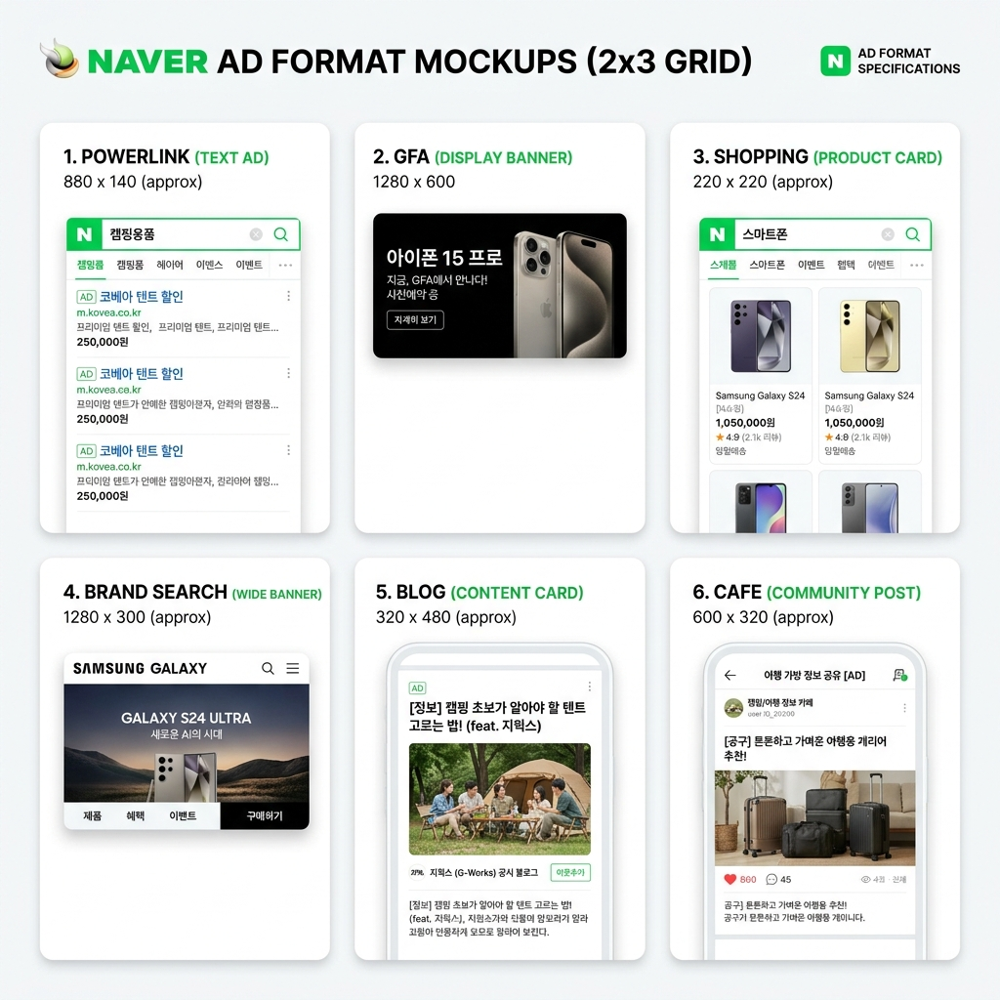

# Automate Naver Ad Creation with AI

Naver dominates the Korean digital advertising market with over 60% search share and an ecosystem of interconnected platforms. For marketers targeting Korea, Naver is not optional. Yet creating compliant creatives for Naver's diverse ad formats has remained a manual, time-consuming process. Until now.

## The Naver Advertising Ecosystem

Naver operates more than 15 distinct advertising platforms, each with unique creative requirements, sizing specifications, and editorial guidelines. A comprehensive Korean campaign requires assets for multiple formats simultaneously.

**Search advertising:**

- **PowerLink.** Naver's primary paid search product. Text-based with strict character limits and display URL requirements.
- **Brand Search.** Premium placement featuring brand logos, sitelinks, and expanded descriptions. Requires multiple image sizes and structured data.
- **Shopping Search.** Product listing ads with image requirements, price display rules, and category-specific guidelines.

**Display advertising:**

- **GFA (Gwanggo Front AD).** Naver's homepage takeover and premium display network. Multiple banner sizes, video support, and rich media capabilities.
- **GFA Banners.** Standard display units across Naver properties. Strict size and file weight limits.
- **Brand Zone.** Immersive brand experiences with custom layouts, video backgrounds, and interactive elements.

**Video advertising:**

- **Naver TV.** Pre-roll and mid-roll video ads on Naver's video platform. Specific duration and resolution requirements.
- **Naver Shorts.** Short-form vertical video for mobile feeds. 9:16 aspect ratio with caption requirements.

**Content advertising:**

- **Naver Blog.** Sponsored content integration with native formatting requirements.
- **Naver Cafe.** Community-based advertising within Naver's forum platform.
- **Naver Post.** Publisher content amplification with specific image and text ratios.

**Partner platforms:**

- **Kakao Display.** Integration with Korea's dominant messaging platform.
- **Kakao Bizboard.** Business profile advertising within KakaoTalk and related services.

**The complexity problem:**

A single campaign targeting Korean consumers might need 30+ distinct creative assets across these platforms. Each requires manual resizing, text adjustment, and format compliance checking. A campaign launch that takes hours for Meta or Google can take days for Naver.

## The Competitor Gap

Global AI ad generators have largely ignored the Korean market. Their platform lists typically include Meta, Google, TikTok, and LinkedIn. Naver is absent.

**AdCreative.ai:** Zero Naver support. Focus entirely on Western platforms.

**Zet AI:** Limited to GFA only. No PowerLink, Shopping, or other core Naver formats. Their 40 presets do not address the full Naver ecosystem.

**The Brief:** No Naver integration. Their Sora 2 and Veo 3.1 video capabilities do not extend to Naver TV or Shorts specs.

**Predis.ai, Canva, Jasper, Lapis, Creatify:** None support any Naver formats.

For Korean marketers, this gap forces a choice: use AI tools for global platforms and manual processes for Naver, or skip AI entirely. Neither option is acceptable for competitive campaigns.

## How OpenSNS Automates Naver Ad Creation

OpenSNS is the only AI ad generator with comprehensive Naver support. The platform optimizer understands each Naver format's requirements and generates compliant creatives automatically.

**Supported Naver platforms:**

| Platform | Format Types | Auto-Optimization |
|----------|--------------|-------------------|
| PowerLink | Text ads | Character limits, keyword insertion |
| Brand Search | Text + images | Logo sizing, sitelink structure |
| Shopping | Product listings | Image specs, price formatting |
| GFA | Display, video | Banner sizes, file weights |
| GFA Banners | Standard display | Multiple IAB sizes |
| Brand Zone | Rich media | Custom layouts, video backgrounds |
| Naver TV | Video pre/mid-roll | Duration, resolution, encoding |
| Naver Shorts | Vertical video | 9:16 aspect, captions |
| Blog | Sponsored content | Native formatting |
| Cafe | Community ads | Post structure, image ratios |
| Kakao Display | Messaging platform | Integration specs |
| Kakao Bizboard | Business profiles | Card layouts |

**The automation workflow:**

1. **Input.** Enter product URL and campaign brief in Korean or English
2. **Research.** AI analyzes the product and Korean market context
3. **Strategy.** Generates campaign angles appropriate for Korean consumers
4. **Copy.** Writes headlines and descriptions within Naver character limits
5. **Creative.** Produces images and videos for each selected platform
6. **Optimization.** Auto-formats for each Naver spec (sizes, aspect ratios, file types)
7. **Export.** Download platform-ready files or publish directly

**Language handling:**

OpenSNS supports Korean input and output natively. Enter briefs in Korean, receive Korean ad copy that respects local linguistic conventions. The AI understands Korean consumer psychology and cultural context, not just literal translation.

## Platform-Specific Examples

**PowerLink automation:**

Input: Product URL for a Korean skincare brand

Output: 10 headline variations (15 characters each, Naver's limit), 10 description lines (30 characters each), all with proper keyword integration and call-to-action placement.

Manual time: 2-3 hours
OpenSNS time: 2 minutes

**GFA banner generation:**

Input: Campaign brief for a mobile game launch

Output: Banner sets in all standard Naver GFA sizes (320x50, 300x250, 728x90, 160x600, etc.) with consistent branding, Korean text, and optimized file weights under Naver's limits.

Manual time: 4-6 hours per size set
OpenSNS time: 5 minutes for all sizes

**Naver Shopping feed:**

Input: Product catalog URL

Output: Shopping-optimized images with proper backgrounds, Korean product titles within character limits, and category-matched descriptions.

Manual time: 30 minutes per product
OpenSNS time: 1 minute per product

**Naver Shorts video:**

Input: Product demo video and campaign brief

Output: 9:16 vertical video with Korean captions, optimal duration (15-30 seconds), and thumbnail selection.

Manual time: 2 hours editing
OpenSNS time: 3 minutes

## The Korean Market Advantage

Naver's dominance means campaigns without Naver presence miss the majority of Korean digital consumers. Yet Naver's complexity has historically required either specialized Korean agencies or significant internal expertise.

**OpenSNS changes the equation:**

- **Global agencies** can now offer Korean market services without hiring Naver specialists
- **Korean marketers** can accelerate production without expanding teams
- **E-commerce brands** can launch on Naver Shopping with the same efficiency as Amazon
- **Local businesses** can compete with larger players through faster creative testing

**Speed to market:**

A complete Naver campaign (PowerLink + GFA + Shopping + Blog) that previously required 3-5 days of production now completes in under 2 hours. This speed enables:

- Real-time campaign adjustments to trending topics
- Weekly creative refreshes instead of monthly
- 10x more A/B testing per campaign
- Rapid response to competitor moves

## Integration with Broader Campaigns

Naver rarely operates in isolation. Korean campaigns typically run across Naver, Meta, Google, and Kakao simultaneously. OpenSNS generates for all platforms in a single workflow.

**Unified campaign example:**

1. Input product URL once
2. Select platforms: Naver (PowerLink, GFA, Shopping), Meta (Feed, Stories), Google (Display, PMax)
3. Receive complete creative package for all platforms
4. Consistent messaging across ecosystems
5. Platform-optimized formatting for each

No duplication of briefs. No inconsistent messaging. No manual resizing between platforms.

## Compliance and Editorial Standards

Naver maintains strict editorial guidelines. Non-compliant ads face rejection or performance penalties. OpenSNS encodes these requirements into the generation process.

**Automated compliance checks:**

- Character count validation for all text fields
- Image size and format verification
- Prohibited content detection
- Trademark and copyright considerations
- Disclosure requirement handling

**Quality assurance:**

While AI handles technical compliance, human review remains recommended for brand safety. OpenSNS includes approval workflows that pause campaigns before final generation, allowing Korean-speaking team members to verify cultural appropriateness.

## Getting Started with Naver Automation

For marketers new to Naver or experienced Korean advertisers, OpenSNS reduces the barrier to comprehensive Naver campaigns.

**New to Naver:**

1. Create OpenSNS account
2. Enter product URL and brief
3. Select Naver platforms from the 15+ options
4. Review AI-generated creatives
5. Export and upload to Naver Ad Manager

**Experienced Naver advertisers:**

1. Connect existing Naver accounts
2. Import current campaign structures
3. Use OpenSNS for rapid variation generation
4. A/B test 10x more creatives than manual production allows
5. Scale winning formats across platforms

**Self-hosted option:**

Korean agencies and enterprises can deploy OpenSNS on local infrastructure for data sovereignty and unlimited generation. The Docker Compose deployment supports Korean language interfaces and Naver API integrations.

## The Bottom Line

Naver is not a niche platform. It is the primary gateway to Korean consumers. Yet until OpenSNS, no AI tool treated it as such. The 15+ Naver format support, Korean language capabilities, and automated compliance checking make OpenSNS the only serious choice for AI-powered Naver advertising.

For any brand targeting Korea, the question is not whether to advertise on Naver. The question is whether to create those ads manually over days, or automatically in minutes.
