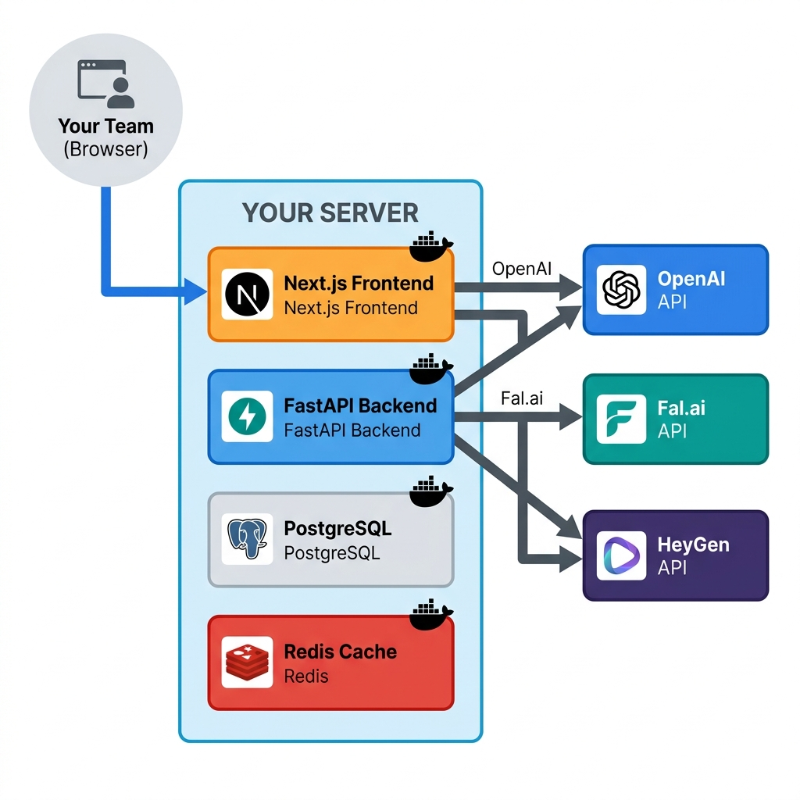

# Self-Hosted AI Marketing: Own Your Data

The SaaS model dominates AI tools. Pay per credit, store data on vendor servers, hope the service stays online. For many teams, this tradeoff makes sense. But for others, the risks of vendor dependence outweigh the convenience. Self-hosting offers an alternative path.

## Why Self-Hosting Matters

The recent history of AI tools includes cautionary tales. Services launch, gain users, then disappear. Sometimes acquired and shut down. Sometimes running out of funding. Sometimes pivoting to enterprise-only tiers that price out early adopters.

**The Icon shutdown example:**

Icon was an AI creative tool that generated brand assets and marketing materials. Users built workflows around it, stored brand guidelines in its system, and created thousands of creative assets. Then Icon was acquired by a larger platform. Within months, the service shut down entirely. Users received 30 days to export data before deletion.

Months of work vanished. Brand assets scattered. Workflows destroyed. Teams scrambled to rebuild with new tools, losing weeks of productivity.

This is vendor lock-in risk made real. When you depend on SaaS tools, you depend on their continued existence, their pricing stability, and their feature roadmap alignment with your needs.

**Self-hosting eliminates these risks:**

- **Service continuity.** Your instance runs as long as you maintain it. No acquisition can shut it down.
- **Data ownership.** All data lives on your servers. No third-party access. No export deadlines.
- **Pricing stability.** Pay only for infrastructure and API costs. No per-credit markups. No surprise price increases.
- **Customization.** Modify the source code to fit your workflows. Add features. Remove limitations.
- **Compliance.** Meet data residency requirements, security standards, and industry regulations.

## How OpenSNS Self-Hosting Works

OpenSNS is architected for self-hosting from day one. The entire platform, including AI engines and workflow automation, runs on your infrastructure via Docker Compose.

**Deployment architecture:**

```
Your Server
├── OpenSNS Application (Docker)
│   ├── Frontend (Next.js)
│   ├── Backend API (FastAPI)
│   ├── Database (PostgreSQL or SQLite)
│   └── AI Engine Orchestration
├── AI Engine Connections
│   ├── OpenAI API (or Ollama for local)
│   ├── Fal.ai API (or ComfyUI for local)
│   └── Optional: HeyGen, D-ID APIs
└── Your Data (100% local)
```



**One-click deployment:**

The Docker Compose configuration completes setup in under 30 minutes:

1. Clone the repository
2. Configure environment variables (API keys, database choice)
3. Run `docker-compose up`
4. Access OpenSNS at your domain

**Bring your own API keys:**

Self-hosted OpenSNS connects to AI services through your own accounts:

- **OpenAI API.** For text generation and analysis. Pay per token directly to OpenAI.
- **Fal.ai API.** For image and video generation. Pay per generation directly to Fal.ai.
- **HeyGen/D-ID APIs (optional).** For UGC avatar videos when premium quality matters.

You pay only the raw API costs, not platform markups. OpenAI charges roughly $0.002 per 1K tokens for GPT-4o mini. Fal.ai charges approximately $0.03-0.05 per image for FluxPro. These are the only costs for unlimited generation.

## Cost Comparison: Self-Hosted vs SaaS

For a team generating 1000 images and 50 videos monthly:

| Cost Component | AdCreative.ai | OpenSNS Hosted ULTRA | OpenSNS Self-Hosted |
|----------------|---------------|-------------------|---------------------|
| Platform fee | $149/mo | $98.99/mo | $0 |
| API costs | Included | Included | ~$35 |
| Infrastructure | N/A | N/A | $20 (VPS) |
| **Total monthly** | **$149** | **$98.99** | **~$55** |
| **Annual cost** | **$1,788** | **$1,187.88** | **~$660** |

At moderate volume, self-hosting costs roughly the same as hosted OpenSNS but removes all generation limits. At high volume, self-hosting becomes dramatically cheaper.

**High volume scenario (10,000 images, 500 videos monthly):**

| Approach | Monthly Cost |
|----------|--------------|
| AdCreative.ai | $1,490+ (overages) |
| OpenSNS Hosted ULTRA | $98.99 |
| OpenSNS Self-Hosted | ~$350 (API + infrastructure) |

Self-hosting at scale costs 75% less than per-credit SaaS pricing.

## Pluggable Engines: Full Control

Self-hosted OpenSNS supports swapping AI engines for fully local operation. This removes even API costs and creates completely air-gapped creative generation.

**Local LLM option (Ollama):**

Replace OpenAI with Ollama running locally:

- Download Llama 3.1, Mistral, or other open models
- Run on your GPU or CPU
- Zero per-generation cost
- Complete data privacy (no external API calls)

Tradeoff: Local models are less capable than GPT-4o for complex analysis. For straightforward creative generation, they work well. For research and strategy nodes, OpenAI may still be preferred.

**Local image generation (ComfyUI):**

Replace Fal.ai with ComfyUI:

- Run Stable Diffusion, SDXL, or Flux locally
- Unlimited image generation at compute cost only
- Custom model training for brand-specific styles
- No external image API calls

Tradeoff: Setup complexity increases. You manage model files, GPU requirements, and generation pipelines. For teams with technical resources, this offers maximum control.

**Local UGC video (SadTalker):**

The SadTalker integration shines in self-hosted deployments:

- Completely free avatar video generation
- Unlimited volume (limited only by GPU)
- No per-minute fees
- Full source code transparency

Tradeoff: Lower visual quality than HeyGen or D-ID. Best for testing, internal content, and cost-sensitive campaigns.

**Hybrid approach:**

Most self-hosted deployments use a mix:

- OpenAI for research and strategy (quality matters)
- Fal.ai for image generation (convenience and quality)
- SadTalker for UGC testing (unlimited volume)
- HeyGen for final premium UGC (pay only for winners)

This balances cost, quality, and capability based on each use case.

## Compliance and Security Benefits

Regulated industries often cannot use SaaS AI tools due to data handling requirements. Self-hosted OpenSNS solves this.

**Data residency:**

All data stays on your servers in your chosen jurisdiction. No cross-border transfers. No third-country processing. Meet GDPR, PIPEDA, or local data protection laws.

**Security control:**

- Implement your own authentication (SSO, 2FA)
- Configure your own network security
- Control access logging and audit trails
- Run vulnerability management on your schedule

**Industry compliance:**

- **Healthcare (HIPAA).** Patient data never leaves your infrastructure.
- **Finance (SOX, PCI).** Campaign data stays within compliance boundaries.
- **Government.** Air-gapped deployments possible with no external connectivity.

## The r/Selfhosted Community Fit

OpenSNS resonates with the self-hosting community ethos: control your tools, own your data, avoid subscription fatigue.

**Community values alignment:**

- **Open source.** MIT licensed. Full source code available.
- **No phone home.** Self-hosted instances do not communicate with OpenSNS servers.
- **API transparency.** Clear documentation of all external calls.
- **Exit freedom.** Export all data anytime. No lock-in.

**Technical requirements:**

Self-hosting requires:
- Linux server (VPS or bare metal)
- Docker and Docker Compose
- 4GB+ RAM (8GB+ recommended)
- Optional: GPU for local AI engines

For the self-hosting community, these are standard capabilities. For less technical teams, the hosted option remains available.

## Migration from SaaS Tools

Teams currently using AdCreative.ai, Canva, or other SaaS tools can migrate to self-hosted OpenSNS without losing work.

**Asset migration:**

- Export brand assets (logos, colors, fonts) from existing tools
- Import into OpenSNS Brand Kits
- Recreate successful templates
- Maintain creative continuity

**Workflow migration:**

- Document current creative processes
- Map to OpenSNS workflow nodes
- Train team on new interface (similar concepts, different layout)
- Parallel run for 2 weeks before switching fully

**Data migration:**

- Historical campaign data typically stays in old tool (reference only)
- New campaigns run through OpenSNS
- Over time, full history builds in your controlled instance

## When to Choose Self-Hosting

Self-hosting is not for everyone. Consider it when:

**You generate high volume.** 1000+ assets monthly makes self-hosting cost-effective.

**You have compliance requirements.** Data must stay within specific jurisdictions or security boundaries.

**You prioritize data ownership.** You want guaranteed access to your data in 5 years, regardless of vendor decisions.

**You have technical resources.** Team members comfortable with Docker, Linux, and basic DevOps.

**You want customization.** You need to modify the platform for specific workflows.

**Choose hosted OpenSNS when:**

- You prefer convenience over control
- Volume is moderate (under 500 assets monthly)
- You lack technical operations resources
- You want immediate setup without configuration

## Getting Started with Self-Hosting

**Prerequisites:**

- Linux server (Ubuntu 22.04 LTS recommended)
- Docker 24.0+ and Docker Compose
- Domain name (for HTTPS)
- API keys for desired AI engines

**Quick start:**

1. Clone `github.com/opensns/opensns`
2. Copy `.env.example` to `.env` and configure
3. Run `docker-compose up -d`
4. Access at `https://your-domain.com`
5. Create first Brand Kit and generate

**Documentation:**

Full deployment guides cover:
- Cloud provider setup (AWS, GCP, Azure, Hetzner)
- Local GPU configuration for AI engines
- Backup and disaster recovery
- Scaling for team size
- Troubleshooting common issues

## The Bottom Line

Self-hosting represents a different philosophy of tool ownership. You trade some convenience for complete control. For teams where data ownership, compliance, or cost predictability matters, this tradeoff is essential.

OpenSNS is the only AI ad generator built for self-hosting from the ground up. Not an afterthought. Not an enterprise upsell. A core architecture decision that puts you in control of your marketing infrastructure.

Your data. Your servers. Your terms.
